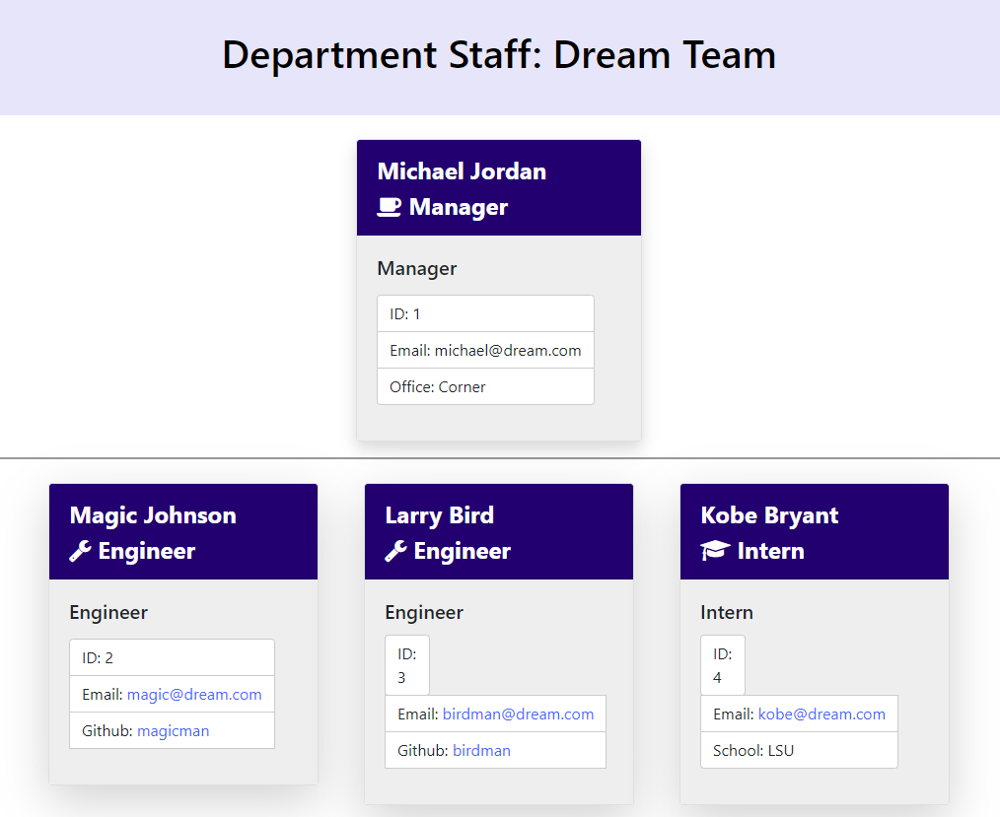

# TeamDirectory

This project prompts for some key information about a team and then creates a convenient web page with useful information.  

## User Story 

It is helpful for a manager to have an html page showing pertinent information for their direct reports, and the page might also be useful to those from other departments.  

## Usage 

This is a Node.js application.  To use it, clone the github directory and use npm install to get the appropriate packages.  Then run the command 

node app.js 

The user is first asked for the name of the team for the header bar.  Next they are asked for the details of the manager of the group.   Then they are prompted to enter information for each employee, until they indicate that there are no more employees to enter. 

## Implementation Details 

* The output page uses Bootstrap for formatting. 
* The prompt questions are stored in arrays and passed into the inquirer.prompt calls, this makes it cleaner to read the code. One set of questions is common to all employees, others are specific to the specific employee role.  
 

